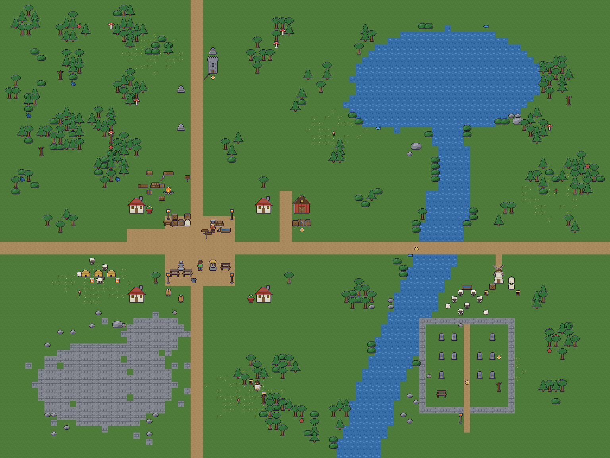

# demo_sprites_4move

A top-down RPG sandbox with code-generated pixel art. Characters, livestock,
tiles and props are drawn by parametric Python rigs, exported to spritesheets
plus `.aseprite` sources, and played in Phaser 3 — with the map, the props, the
NPCs, their dialogue and the errands they hand out all loaded from
engine-neutral JSON. Sheep and goats wander and graze on their own.

The world is four 20×20 wildernesses you walk between — fells and pine woods,
a shieling, a boar that hunts its own patch, and a lake north of it all with an
old burrow tree four tiles across — with 36 kinds of prop and fifteen kinds of
thing to pick up, three of which go in the weapon hand and swing.



## Quick start

```sh
python tools/build.py          # regenerate all art + data  (needs Pillow)
node tools/shot.cjs            # boot the game headless, check it, photograph it
```

Then open `game/index.html` — double-click is enough, no server needed.
**Arrows / WASD** move · **E** talk / take · **Space** slash · **I** bag ·
**C** character sheet · **J** journal · **Q** swap weapon. On a phone there is
a d-pad.

`game/page.html` is the same game as a single self-contained file, which is what
gets published when a link is wanted.

## Layout

```
tools/gen/        the generators: palette, character rig, tiles, props
tools/pipeline/   aseprite I/O, atlas packing, manifest, validation gates
tools/build.py    entry point
tools/shot.cjs    headless-Chromium smoke test that leaves a screenshot behind
content/          AUTHORED data - engine-neutral JSON, human-diffable
build/            GENERATED - safe to delete at any time, never hand-edit
game/             the Phaser 3 game
CLAUDE.md         the change loop: build, screenshot, publish
```

The rule: `tools/` and `content/` are truth. Everything in `build/` and
`game/art-embed.js` is derived and reproducible.

## The pipeline

```
content/*.json  +  tools/gen/*.py
        │  generate
build/atlas/*.png  ·  build/manifest.json  ·  build/aseprite/*.aseprite
        │  validate   ← 32 gates, all must pass
game/art-embed.js  →  game/index.html + main.js  →  game/page.html
```

It also runs backwards for hand-drawn work: `build/aseprite/*.aseprite` are real
layered, tagged Aseprite files. `tools/pipeline/aseprite.py` is a from-scratch
ASE reader/writer (stdlib only), so neither direction needs Aseprite installed.

### The gates

`tools/pipeline/validate.py` is what keeps a generated asset set honest. Every
failure points at an authored file, never at generated output:

| Gate | Catches |
|---|---|
| `id-format`, `sprite-format` | typo'd or malformed IDs |
| `sprite-exists` | a definition pointing at art that was never generated |
| `actor-states` | an actor that declares no states |
| `actor-complete` | an actor declaring a state its rig cannot generate |
| `actor-anchor` | frames of one actor disagreeing on the anchor (jitter) |
| `anchor-bounds` | an anchor outside its own frame |
| `tile-seam` | a tile that would show a seam when repeated |
| `map-shape`, `map-legend` | a ragged map grid or an undefined legend character |
| `map-entity` | a placement pointing at nothing, or off the edge of the map |
| `map-footprint` | a cottage with one corner in the river |
| `map-overlap` | two solid things claiming the same tile |
| `map-spawn` | a spawn in water, or inside a wall |
| `map-exit` | a way to another map that lands nowhere real, or lands on the way back |
| `actor-hostile` | a creature that attacks with a number missing, or that would drop the chase as it started |
| `actor-hp` | a creature that can be struck but never killed, or killed by nothing |
| `dialogue-exists` | an NPC pointing at dialogue that does not exist |
| `dialogue-shape` | a conversation with no start, or a node that says nothing |
| `dialogue-links` | a reply pointing at a node that is not there, or writing nobody can reach |
| `dialogue-effects` | a branch waiting on a flag no choice ever sets, or trading an item that does not exist |
| `quest-shape` | an errand with no objectives, or an objective of a kind the engine cannot track |
| `quest-target` | being sent to talk to something with nothing to say, or to kill something that cannot die |
| `quest-reward` | an errand that pays an item nobody drew |
| `quest-supply` | fetch three berries where the maps place two — an errand that reads perfectly and cannot be finished |
| `quest-reach` | an errand nobody offers, or one that can be finished but never handed in |
| `item-kind` | an item the engine has no idea what to do with, or a weapon with nothing to draw |
| `item-held` | a weapon the hero could equip but has no frames for - a sprite with holes |
| `deterministic` | the build drifting between runs |

## How the art works

**The character is a rig, not a pile of drawings.** `draw_actor(direction, bob,
leg, swing)` composes the same body-part functions for every frame, so the
character cannot drift between facings or states. Outlines are computed from the
silhouette, not drawn.

**A second character costs a palette, not art.** Sprites store palette *keys*,
so `VARIANTS` in `tools/gen/palette.py` turns one rig into many characters —
Arne the smith is the hero's frames with a rust apron and grey hair.

**Three rigs, one contract.** `tools/gen/actor.py` is the biped; `animal.py` is
the quadruped (walk, idle and a head-down `graze`); `giant.py` is the monster —
three tiles tall, two wide, with a slow `attack` its own frames draw. All three
share the same ground line, the same anchor rule and the same `build_frames()`
shape, so the atlas, the anchors and the depth sorting treat them identically.
A goat is the sheep rig with horns, a beard, a smooth back and a tan palette —
which species an actor uses is a `"rig"` field in `content/`, not a pipeline
change.

**Anchors, not offsets.** Every sprite exports the pixel that sits on a map tile
(`[16, 29]` — between the feet). The game sets sprite origin from it, so art of
any size lines up and sorting by `sprite.y` is correct depth sorting. That is
what lets structures use a bigger frame: cottages, the barn, the tower and the
windmill are drawn 48×48 on their own atlas with anchor `[24, 45]`, and the
scene needs no special case for them — it reads the frame size off the atlas.
The troll is the same trick applied to something that walks: 64×64 on a sheet
of its own, anchored at `[24, 61]` so it stands on two tiles.

**Light comes from the silhouette too.** `_shade()` in `tools/gen/props.py`
lights the pixels of a mass that face up-left and shades the ones that face
down-right, so a prop is drawn as a shape and lit as a consequence. Thirty
props fit in one file because none of them spells out its own shading.

## How the game works

`game/main.js` contains no art and no content. Frame sizes, animations, tiles,
props, actors, dialogue and the map all come from `window.ART.manifest`. Adding
an NPC means adding a JSON file and a line in the map — no JS change:

```json
{
  "id": "npc.sheep", "sprite": "actor.sheep", "rig": "quadruped",
  "states": ["walk", "idle", "graze"], "speed": 16, "blocks": false,
  "interact": "dlg.sheep_baa",
  "wander": { "radius": 4, "idle_ms": [900, 2200],
              "graze_ms": [2500, 6000], "graze_chance": 0.6 }
}
```

Wandering is content too: the radius, the pause lengths and how often an animal
would rather eat than walk are all tuned in JSON, not in the scene code.

Maps are human-editable ASCII with a legend, which diffs cleanly and ports to
any engine:

```json
"legend": { ".": "tile.grass", "p": "tile.path", "~": "tile.water" },
"ground": ["..............p.................", "..."]
```

**Collision is authored, not drawn.** A definition's `footprint` lists the tiles
it stands on as offsets from its anchor tile — `[[0, 0]]` for a barrel, six
offsets for a three-by-two cottage. The scene puts one static body on each, so a
tree's canopy can overhang ground you can still walk on, and a building is solid
across its whole base without being cut into three sprites.

## Talking

A conversation is a graph, not a script: **nodes** of text joined by the
**choices** the player is offered. Which choices appear is decided when the
node is entered, so a reply can be offered only while you are carrying
something, or only once an NPC has asked you for it.

```json
"start": [{ "when": { "flag": "chest.opened" }, "goto": "empty" },
          { "goto": "shut" }],
"nodes": {
  "shut": { "text": ["Locked. Someone went to real trouble over it."],
            "choices": [
              { "text": "Turn the key.", "goto": "open", "when": { "has": "item.key" },
                "take": "item.key", "give": "item.coin", "set": "chest.opened" },
              { "text": "Leave it." }] } }
```

**Entry rules** are what make a conversation remember: `start` is either a node
name or a list of rules, and the first whose condition holds is where you come
in. The condition language is deliberately tiny — `flag`, `noflag`, `has`,
`nothas`, `quest`, and `all` to combine them — small enough that a gate can
check every branch is reachable and every flag is one some choice actually
sets. A choice with no `goto` ends the conversation.

Effects run **finish, take, give, set, start**: handing a quest in is what
empties the bag, so it goes before anything that tries to fill it, and trading
the last thing in a full bag still works. Anything given that will not fit
drops at your feet rather than vanishing.

The panel is the bag's planks, sliding up from the bottom: a speaker plate,
the line, and the replies numbered 1–4. Arrows or the number keys pick one,
**E** answers, and on a phone you just tap the reply.

## Errands

Flags alone were enough for one errand — ask Arne for iron ore, bring him a
lump, get his father's key — but not for keeping track of three of them, or
for telling the player how far along they are. A quest is a file in
`content/quests/` and two replies: one that offers it, one that takes it back.

```json
{ "id": "quest.arne_berries", "name": "A Handful of Berries",
  "giver": "npc.arne",
  "objectives": [
    { "id": "ask",  "kind": "talk",    "target": "npc.goat",
      "text": "Have a word with the goat" },
    { "id": "pick", "kind": "collect", "target": "item.berries", "count": 3,
      "text": "Gather three handfuls of berries" }],
  "reward": { "xp": 30, "give": "item.coin", "set": "arne.berries_done" } }
```

The engine knows four kinds of objective — **collect**, **kill**, **talk**,
**visit** — and nothing about any particular errand. No list of quests exists
anywhere in `game/main.js`.

**A quest is in one of four states**, and those four words are the whole
language a conversation has for asking about one: `none`, `active`, `ready`
(every objective met, not yet handed in) and `done`. A reply asks with
`"when": { "quest": { "id": "quest.arne_berries", "is": "ready" } }` — one key
rather than four, `is` may be a list, and that is also how "taken but not
finished" is said without needing a negation. `"start"` and `"finish"` on a
reply are the two effects.

**Fetching is counted off the bag rather than remembered**, so putting a berry
down takes the tick away again and no bookkeeping can drift out of step with
what you are actually carrying. Handing a quest in takes what it asked for
without the content having to say so twice.

**A creature dies only if its definition says how much it can take.** `"hp"` on
an actor is the whole of it: the boar has 18, the elk 26, the troll 60, and the
sheep have none, so they can be hit all day and only ever bolt. Nothing in the
engine knows which animals those are — and a `kill` objective on something with
no `hp` fails a gate, because it is a bounty that can never be collected.

**J** opens the journal: what is outstanding, how far along each objective is,
and what it pays — planks again, from the right-hand edge. Taking an errand,
ticking one off and finishing it each say so once in a toast, because by the
time an objective is met you are usually somewhere else.

Arne stands on the road through Wilderness II and has three things he wants
doing. The ore is still flags; the berries and the boars are quests.

## Items, the bag, and the weapon hand

An item is a 16×16 icon drawn once in `tools/gen/items.py` and used twice: it
lies on the ground with a slow bob, and the HUD cuts the same cell out of the
same atlas for the bag. What it *is* — `material` or `weapon`, whether it
stacks — is `content/items/`. Walk up to one and press **E**: the hero crouches
(`gather`, three frames of the same rig, hands to the ground) and it goes in
the bag. **I** slides the bag in from the left of the stage: a wooden panel of
4×4 slots, one thing per slot, nothing stacks — sixteen is the limit, and the
prompt says so when it is reached. Arrows walk the cursor; **E** draws the
weapon under it, or puts it away. The icons are the same 16×16 cells at 3×.

**A weapon is a sprite swap, not a second sprite.** The biped rig draws a held
weapon into every pose from the hand outward along a direction — so one
description of a sword serves the walk, the crouch and each frame of the swing,
and the same frame decides whether the blade is in front of the body or behind
it. `tools/build.py` bakes one frame set per weapon (`actor.hero_sword`,
`_axe`, `_spear`) and writes the map from item to frame set into the hero's
manifest record; the scene arms the hero by switching sprite base and nothing
else. **Space** swings (`slash`: wind up, strike, follow through, recover),
**Q** cycles what is in the bag. The strike lands on the second frame: anything
in the arc a tile ahead flashes, livestock bolts, and props marked `hittable`
shake — the scarecrow is there to be practised on. Each hit floats a number
off the target — the weapon's `damage`, give or take a fifth — with sparks
thrown out round it. The digits are 3×5 glyphs from `tools/gen/fx.py`, an
atlas of their own, so they are pixels the same size as the blade that caused
them rather than text blurred at 3×.

Picking up the first weapon draws it; the sword is by Arne's anvil, the felling
axe at the woodcutters' camp, the spear in the old tower.

**Armour is worn the same way a weapon is held.** `ARMOURS` in the rig draws a
mail shirt over the tunic after the torso and before the arms, so sleeves and
collar stay the character's own; the build bakes one frame set per
weapon-and-armour pair (`actor.hero_sword_mail` and the rest) and writes the
whole table into the hero's record as `looks`, keyed `"<weapon>|<armor>"`.
Putting the shirt on is the same one-string switch as drawing a sword. The
mail shirt lies a few steps from where you start; the first one picked up is
worn, and **E** on it in the bag takes it off again.

## Verification

- Every `.aseprite` is parsed back at build time and checked against its source.
- The manifest is assembled twice per build and compared, so the build is proven
  deterministic rather than assumed to be.
- `node tools/shot.cjs` runs the real game in headless Chromium and asserts that
  it came up: no console errors, the physics world matching the map the manifest
  declares, one sprite per placed entity, one static body per blocked tile, and
  livestock actually wandering. It exits non-zero when a check fails — the
  screenshot it writes to `build/shot.png` is the by-product, not the point.
  `--talk` presses **E** and checks the dialogue box opens; `--gather` presses
  it beside an item and checks the crouch played and the bag grew by one;
  `--bag` presses **I** and checks the panel opened and the cursor moves;
  `--give item.axe --slash` arms the hero, presses **Space** and checks the
  swing played and handed control back. `--map` renders the whole 96×72 world
  as one frame; `--pose slash,1 --page` freezes the strike and photographs the
  page with its bag and buttons.
- `node tools/shot.cjs --on map.wilderness2 --quest` takes every errand the
  people on a map can offer and runs each one to the end: it finds its own way
  through the conversation to the reply that starts the quest, has a word with
  the goat, picks the berries off the ground, crosses a map edge, kills the
  boars, comes back and hands it in — then checks the quest is done, the
  berries are gone, the reward is in the bag and the journal survived the
  crossing. Nothing in it names a quest, a reply or an item, so it goes on
  testing the system rather than one errand somebody wrote down in the test.
- `node tools/editor_test.cjs` drives the editor the same way: it erases the
  berries on the open map and checks the quest board goes short *before*
  anything is saved, and that every node of a conversation is drawn, none on
  top of another, with every reply landing on a box.

## Engine note

The Godot-or-Phaser decision is deliberately still open. `content/` and
`build/manifest.json` are engine-neutral; only `game/` is Phaser-specific. Moving
to Godot means writing an importer for the same manifest, not redoing the art or
the content.

Requires Python 3.9+ with Pillow (`pip install pillow`). Phaser is vendored in
`game/vendor/`, so the game works offline; it falls back to the CDN if absent.
