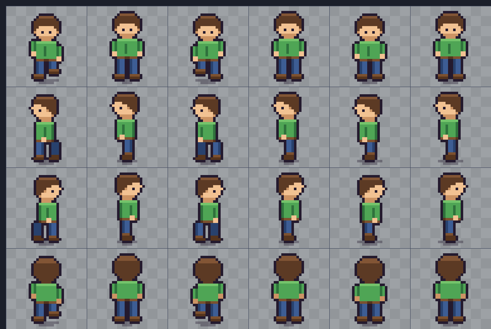

# demo_sprites_4move

A pixel-art hero with 4-direction walk + idle animations, generated from code,
exported to a real `.aseprite` file and a spritesheet, and driven in a Phaser 3
demo you can play with the arrow keys or WASD.



## Quick start

```sh
python tools/build.py          # regenerate all art  (needs Pillow)
```

Then open `web/index.html` — double-click is enough, no server needed. Move with
the **arrow keys** or **WASD**.

## The pipeline

```
tools/hero.py          parametric pixel rig  ← the single source of truth
      │                palette + body parts + pose table
      ▼
tools/build.py ──┬──► art/hero.aseprite    layered + tagged, open it in Aseprite
                 ├──► art/props.aseprite   ground tile + bush
                 ├──► art/hero.png         192×128 sheet, 6×4 frames of 32×32
                 ├──► art/props.png
                 ├──► art/hero.json        Aseprite-format atlas + frameTags
                 ├──► art/hero_sheet.svg   scalable reference
                 ├──► art/preview.png      6× contact sheet (the image above)
                 └──► web/art-embed.js     sheets as data URIs + anim config
                            │
                            ▼
                 web/index.html + main.js  Phaser 3 scene
```

It runs both ways:

```sh
python tools/build.py                  # rig → .aseprite + every export
python tools/build.py --from-aseprite  # .aseprite → every export, file untouched
```

So the rig writes the first draft, you refine frames by hand in Aseprite, and
the build re-exports the PNG, JSON, SVG and the game's embed from *your* edited
file. `tools/aseprite.py` is a from-scratch ASE reader/writer (stdlib only), so
neither direction needs Aseprite installed.

## Why it is built this way

**The character is a rig, not 24 drawings.** `draw_hero(direction, bob, leg,
swing)` composes the same `head_front`, `torso_side`, `legs_front` … functions
for every frame. Consistency is structural: the head cannot drift between
`walk-down` and `idle-down` because it is literally the same code path. Changing
the tunic colour, the walk stride or the head shape is one edit that propagates
to all 24 frames instead of 24 edits that have to agree.

**Outlines are computed, not drawn.** Each cel is drawn in flat colour and then
`Canvas.outline()` wraps the silhouette in 1px of outline colour. Every frame and
prop gets an identical, gap-free outline for free.

**Left is a mirror of right, baked into real frames.** The rig draws `right` and
flips it, but the flipped frames are written to the sheet as their own frames.
The game never needs `flipX`, and an artist opening the file sees all four
directions.

**Feet stay planted.** The body bob moves the hips and shoulders; the ground line
(`FOOT_Y`) never moves, so the legs stretch a pixel instead of the whole sprite
hopping. Props are grounded on the same line, which is why sorting sprites by `y`
is all the depth sorting the scene needs.

**The game reads the build's output, not hardcoded numbers.** Frame size and the
eight animations (ranges, frame rates, per-frame hold times) come from
`window.ART` in `web/art-embed.js`. Add frames in Aseprite, re-run the build, and
the scene picks them up with no JS change.

### Why not just draw it in Aseprite by hand?

For a *final* character, hand-drawing wins — subtle weight and squash are hard to
express as parameters. This pipeline targets the part before that: getting a
consistent, animating, in-engine character in minutes, with a real `.aseprite` to
take over by hand when you want to. The `--from-aseprite` direction exists so
that handover is not a dead end.

## Sheet layout

One row per direction, 6 frames each: 4 walk + 2 idle.

| row | direction | walk frames | idle frames |
|-----|-----------|-------------|-------------|
| 0   | down      | 0–3         | 4–5         |
| 1   | left      | 6–9         | 10–11       |
| 2   | right     | 12–15       | 16–17       |
| 3   | up        | 18–21       | 22–23       |

Walk is a classic 4-frame cycle (contact, passing, contact, passing) at 120 ms;
idle is a 2-frame breath at 500 ms. `art/hero.aseprite` carries the same 24
frames in the same order, tagged `walk-down`, `idle-down`, … on two layers:
`hero` and a soft `shadow` underneath.

## Editing

- **Colours / proportions / timing** → `tools/hero.py`: `PALETTE`, the anatomy
  constants (`HEAD_TOP`, `TORSO_TOP`, `FOOT_Y`, …), the `WALK` / `IDLE` pose
  tables. Re-run `python tools/build.py`.
- **Individual frames** → open `art/hero.aseprite`, edit, save, then
  `python tools/build.py --from-aseprite`. Adding frames is fine: the sheet grid
  and the Phaser animations follow the file's frames and tags.
- **Scene** → `web/main.js` (speed, bush positions, world size).

## Using the art elsewhere

`art/hero.png` + `art/hero.json` are a standard Aseprite spritesheet export, so
they load directly:

```js
this.load.atlas('hero', 'art/hero.png', 'art/hero.json');   // needs a server
// or, with no server and no JSON:
this.load.spritesheet('hero', 'art/hero.png', { frameWidth: 32, frameHeight: 32 });
```

`web/art-embed.js` inlines the same PNG as a data URI, which is what lets
`index.html` run from `file://`.

## Verification

- `tools/build.py` parses every `.aseprite` it writes back in and asserts the
  layers, tags, durations and every cel's pixels match what went in.
- Both build modes produce byte-identical `hero.png`, `hero.json`, `hero.svg` and
  `art-embed.js`, which proves the ASE file is a lossless carrier of the sprite.
- The demo was driven in headless Chrome over the DevTools protocol: 15 checks
  covering boot, all four directions on both key sets, idle-on-release,
  diagonal speed normalisation, diagonal facing and bush collision.

## Layout

```
tools/hero.py       pixel rig: palette, body parts, poses, props
tools/aseprite.py   .aseprite reader/writer (stdlib only)
tools/build.py      exporters + self-verification
art/                generated art (do not hand-edit anything but the .aseprite)
web/                Phaser 3 demo; vendor/phaser.min.js is pinned at 3.90.0
```

Requires Python 3.9+ with Pillow (`pip install pillow`). Phaser is vendored, so
the demo works offline; it falls back to the CDN if `web/vendor/` is missing.
